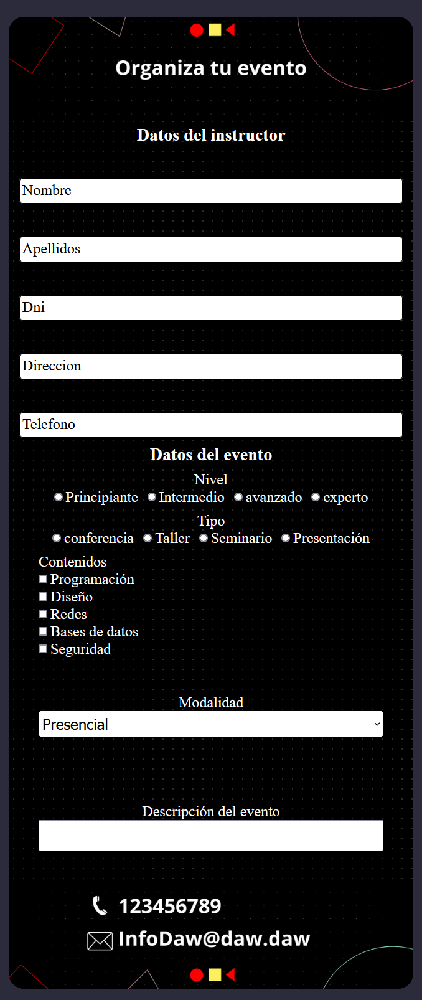
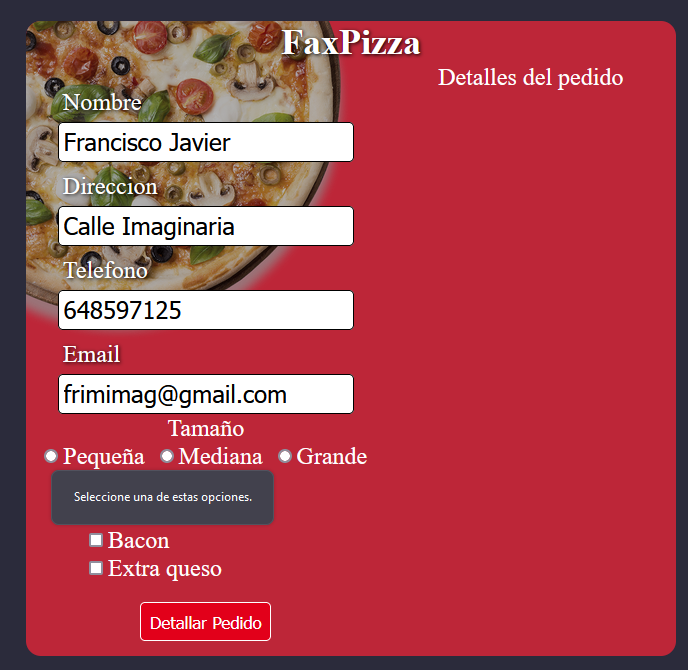
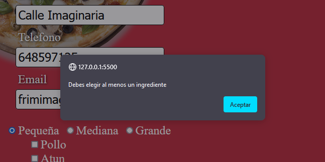
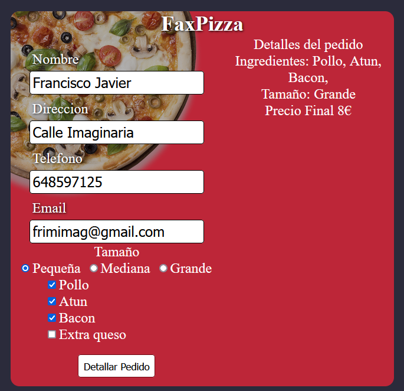

# AE-1. DOM y Formularios 

## Requerimiento 1

Para el Requerimiento 1, se ha generado un formulario dinámico utilizando métodos de modificación del DOM en JavaScript.

Con el objetivo de estructurar el código de manera más organizada y modular, se ha creado la clase `InputComponent`. Esta clase contiene el método `inputContainer`, el cual acepta un objeto con los siguientes parámetros:

- **`inputType` (string)**: Define el tipo de campo de entrada que se creará en el formulario. Puede ser `"text"`, `"radio"`, `"checkbox"`, `"select"`, `"textarea"` o `"submit"`. Este parámetro determina el tipo de elemento de entrada HTML que se generará.

- **`inputLabel` (string)**: Representa la etiqueta o texto asociado al campo de entrada. Es la descripción del campo que se mostrará al lado del elemento de entrada generado. Por ejemplo, para un campo de tipo `"text"`, `inputLabel` podría ser `"Nombre"`, `"Apellidos"`, etc.

- **`idName` (string)**: Es el valor del atributo `id` del campo de entrada. Este identificador es útil para asociar la etiqueta del campo de entrada con el propio campo, mejorando así la accesibilidad y la usabilidad del formulario.

- **`options` (Array)**: Este parámetro es opcional y se utiliza en campos de tipo `"radio"` y `"select"`. Es un array de objetos que contiene las opciones para los elementos de radio o las opciones del menú desplegable. Cada objeto debe tener `value` y `label`, donde `value` es el valor que se enviará al servidor cuando se seleccione esa opción, y `label` es la etiqueta visible para el usuario.

- **`required` (boolean)**: Es un parámetro opcional que indica si el campo de entrada es obligatorio o no. Si se establece en `true`, el campo de entrada requerirá una entrada antes de que el formulario pueda ser enviado. Si no se proporciona, se asume como `false` por defecto.

Usando esta estructura modular y orientada a objetos, se han añadido al formulario del Requerimiento 1 los elementos HTML requeridos, cumpliendo con los criterios establecidos en el enunciado. La clase `InputComponent` permite crear y gestionar fácilmente distintos tipos de campos de entrada y mejorar la legibilidad y mantenibilidad del código.

Para ver el código fuente del Requerimiento 1 este se ejecuta en la función req1, haz clic [aquí](./script.js).

### Resultado 

## Requerimiento 2: Pedido de Pizza

Para el requerimiento 2, se ha generado el formulario de forma dinámica utilizando la clase `InputComponent` y se ha calculado el precio del pedido utilizando la clase `Pizza` 

### Clase `Pizza`

La clase `Pizza` se utiliza para calcular el precio total del pedido en función del tamaño de la pizza y los ingredientes seleccionados. El constructor de la clase acepta dos parámetros:

- `size`: representa el tamaño de la pizza (pequeña, mediana o grande).
- `ingridients`: representa la cantidad de ingredientes seleccionados para la pizza.

La función `checkPrice()` calcula el precio de la pizza en base a los siguientes criterios:

- 5€ para la pizza pequeña.
- 10€ para la pizza mediana.
- 15€ para la pizza grande.
- Cada ingrediente seleccionado tiene un costo adicional de 1€.

Al sumar estos valores, se obtiene el precio total del pedido, que se devuelve como un número entero.

Cuando se envía el formulario, se activa un evento `submit` que realiza las siguientes acciones:

1. **Previene el comportamiento predeterminado del formulario**, deteniendo el envío estándar al servidor.
2. **Recopila los datos del formulario**, incluyendo el tamaño de la pizza y los ingredientes seleccionados.
3. **Verifica si se han seleccionado ingredientes**; si no, muestra una alerta indicando que al menos un ingrediente debe ser seleccionado.
4. **Calcula el precio total del pedido** basado en el tamaño de la pizza y la cantidad de ingredientes elegidos.
5. **Muestra los detalles del pedido** en la sección correspondiente del formulario, incluyendo los ingredientes seleccionados, el tamaño de la pizza y el precio final en euros.

Para ver el código fuente del Requerimiento 2 este se ejecuta en la función req2, haz clic [aquí](./script.js).

### Resultado

- Caso de no haber seleccinado una opción como el tamaño

- Caso de no haber seleccionado minimamente un ingrediente

- Caso de haber seleccionado el tamaño y un ingrediente minimo
