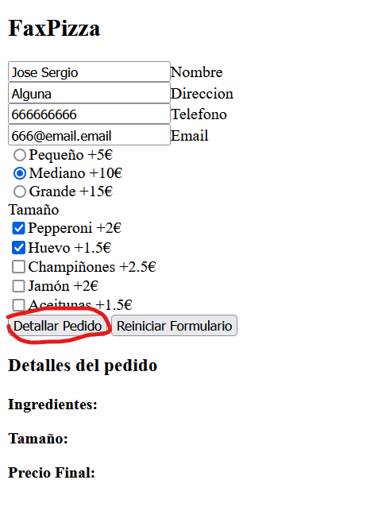
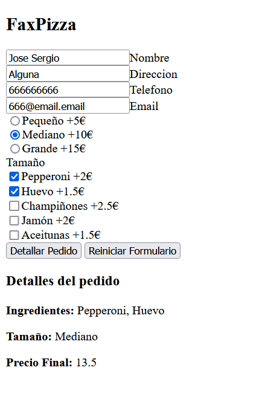
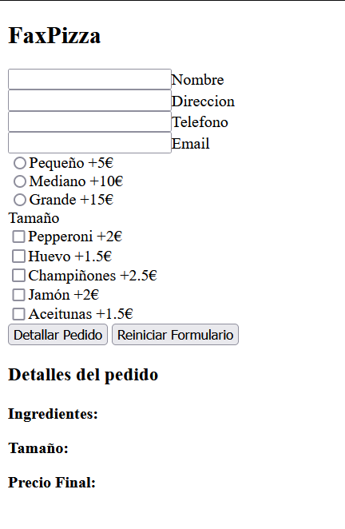
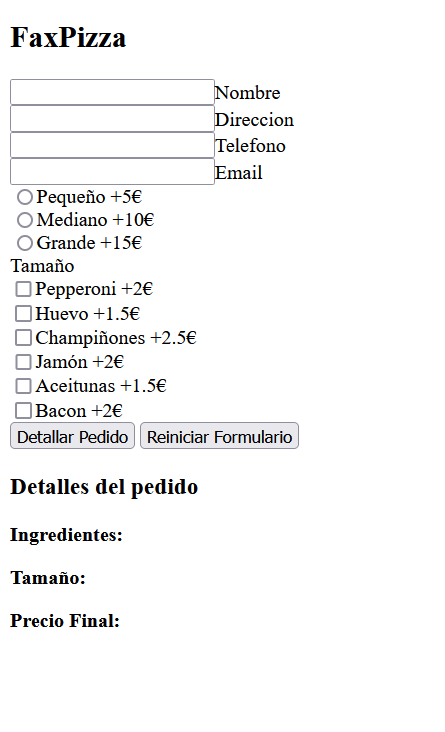

# AE-2. AJAX

## Ejecutar el codigo

### Metodo 1

Para ejecutar el codigo solo hay que descargar todos los ficheros mediante un live server Ejemplo: `https://marketplace.visualstudio.com/items?itemName=ritwickdey.LiveServer` ejecutar index.html

Ejecutar directamente el fichero index.html no funciona debido a la separación de las clases y metodos es varios ficheros .js provoca el error CORS request not HTTP.

La dirección utilizada durante las pruebas es `"http://127.0.0.1:5500/AE-2"`

## Requerimiento 1

Se pide hacer una aplicación AJAX que gestione una pizzería como la actividad 1. Puedes basarte en dicha actividad para reutilizar lo que consideres o para hacerte una idea de lo que tienes que implementar junto a tu compañero. El formulario que tendremos que usar será el mismo que en dicha actividad, consúltala para más información.

La idea es simular un entorno de acceso a servidor para traer toda la información que se necesite para cargar la página. La página cargará parte de los datos de manera dinámica, concretamente los tamaños y los ingredientes. Dichos datos estarán en formato JSON, por lo que habrá que tratarlos en el cliente para poder mostrarlos.

Nada más terminar de cargar la página, se accederá mediante AJAX a datos en un fichero del servidor para traer los tamaños de las pizzas y cargarlos dinámicamente. Al mismo tiempo, nos traeremos los ingredientes que tenemos disponibles para mostrarlos en nuestra pizzería.

También dispondremos de un botón de refrescar, de tal manera que cuando lo pulsemos haremos una llamada de nuevo a nuestro servidor para traernos los posibles cambios de los datos de nuestra aplicación.

Valoración: 7 puntos sobre 10

## Requerimiento 2

Si pulsamos el botón de procesar el pedido, la web mostrará el resultado del precio total de la pizza. Para calcular dicho precio, el programa accederá mediante AJAX al servidor para traer la información sobre el precio del tamaño de la pizza escogido, así como el precio de los ingredientes escogidos. El precio de los ingredientes podrá ser diferente.

Valoración: 3 puntos sobre 10

## Comprobaciones

Formulario base sin pulsar boton de detallar pedido
 

Formulario base al detallar pedido se pueden ver los datos del pedido
 

Al pulsar el boton de reiniciar se elimina todo rastro del contenido anterior
 

Al alterar el contenido del json y pulsar el boton reiniciar se añade el nuevo producto
 
