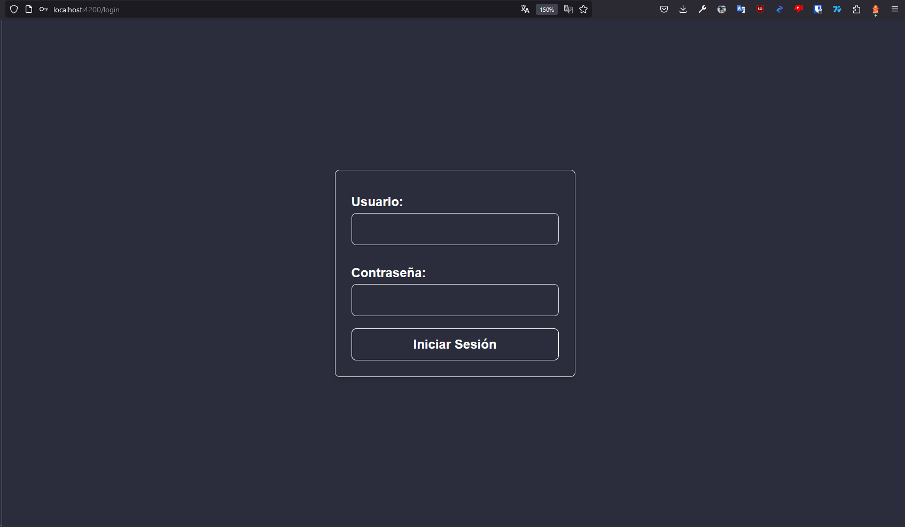
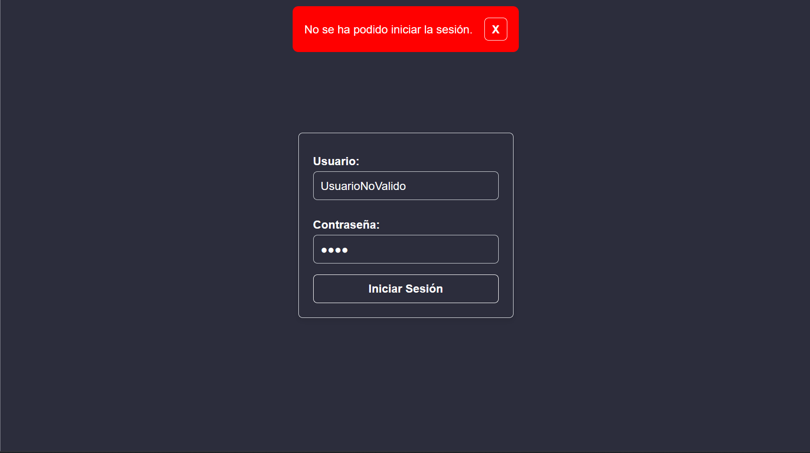

# Ae3Angular

This project was generated with [Angular CLI](https://github.com/angular/angular-cli) version 13.1.4.

## Development server

Run `ng serve` for a dev server. Navigate to `http://localhost:4200/`. The app will automatically reload if you change any of the source files.

## Code scaffolding

Run `ng generate component component-name` to generate a new component. You can also use `ng generate directive|pipe|service|class|guard|interface|enum|module`.

## Build

Run `ng build` to build the project. The build artifacts will be stored in the `dist/` directory.

## Running unit tests

Run `ng test` to execute the unit tests via [Karma](https://karma-runner.github.io).

## Running end-to-end tests

Run `ng e2e` to execute the end-to-end tests via a platform of your choice. To use this command, you need to first add a package that implements end-to-end testing capabilities.

## Further help

To get more help on the Angular CLI use `ng help` or go check out the [Angular CLI Overview and Command Reference](https://angular.io/cli) page.

# AE-3 Angular

Proyecto realizado usando la versión de angular cli 13.1.4

## Metodo de ejecución

Para poder ejecutar este proyecto primero se debe descargar los ficheros contenidos en `https://github.com/zenix-s/DAW/tree/main/DWEC/AE-3/`
En un terminal se ejecuta el comando `npm install` esto descargara todas las dependencias necesarias para poder visualizar nuestra web.

Utilizando el comando `ng serve -o` abriremos un servidor el cual nos permitira visualizar nuestra web el flag -o nos abrira automaticamente una nueva pestaña.

## Requerimiento 2

> Requerimiento 2
>
> Para entrar en la página deberemos de estar registrados, se mostrará una página de “login” al principio donde deberemos de poner nuestro nombre de usuario y >nuestra contraseña. La aplicación tendrá algunos usuarios por defecto.
>
> En caso de que no podamos entrar en la página, se nos mostrará otra vez la página de “login” diciendo que no hemos podido acceder.

Se empieza por este requerimiento ya que es lo primero en experimentar el usuario

Independientemente de a donde trate de dirigirse el usuario en caso de no estar logueado sera redirigido a la pagina de login.



En caso de intentar loguearse con un usuario y contraseña no validos



En caso de iniciar con un usuario y contraseña validos nos redirigira a `/`

Listado de usuarios validos

```json
  users = [
    {
      userName: 'root',
      password: 'root',
    },
    {
      userName: 'user',
      password: 'user',
    },
    {
      userName: 'zenix-s',
      password: 'zenix-s',
    },
  ];
```

En la vista principal tenemos un listado con los videojuegos y nuestro usuario
