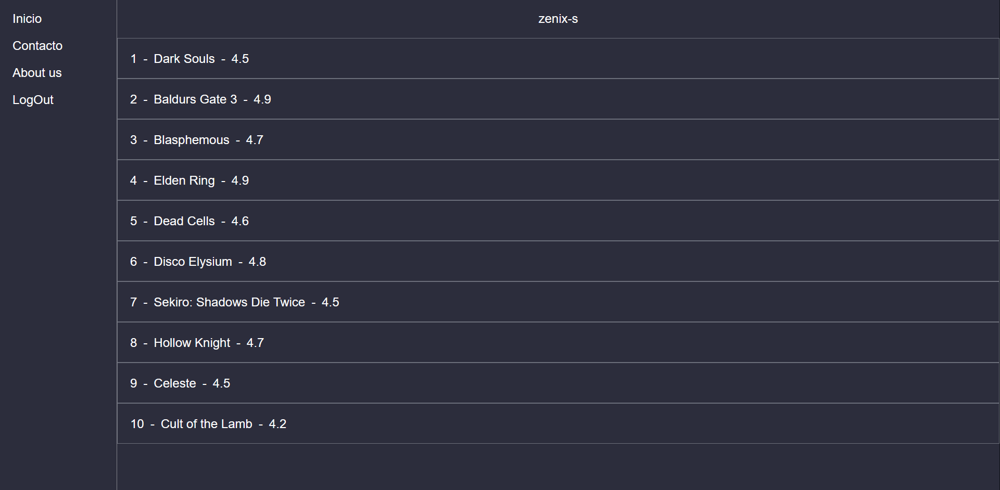
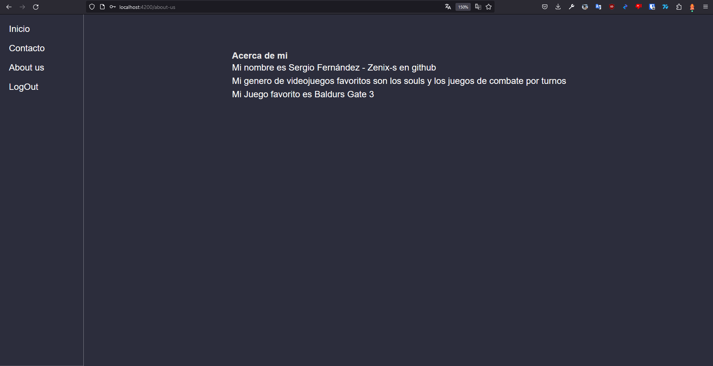
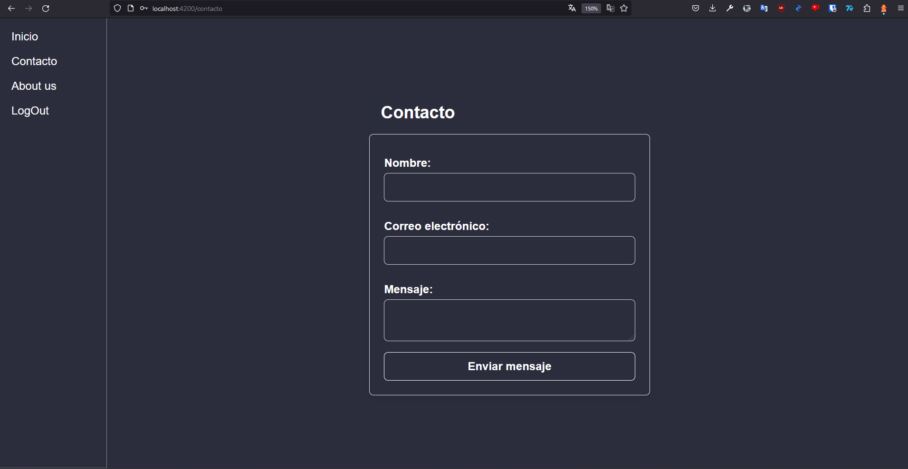
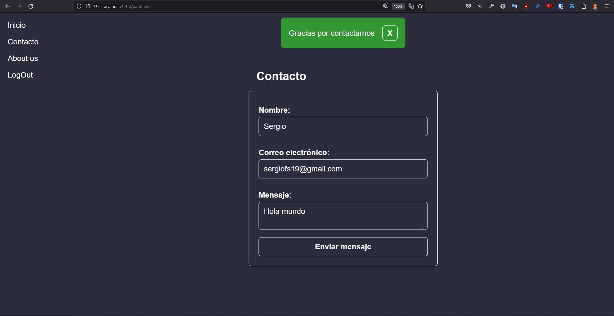
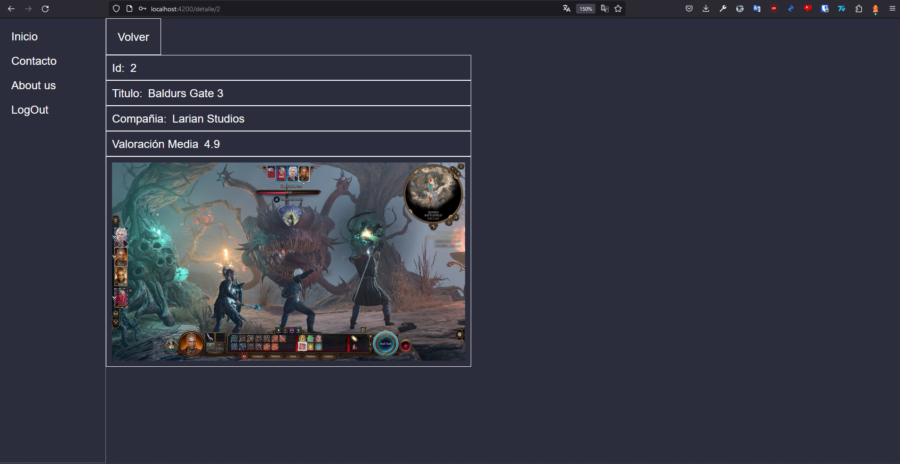

# AE-3 Angular

Proyecto realizado usando la versión de angular cli 13.1.4

## Metodo de ejecución

Para poder ejecutar este proyecto primero se debe descargar los ficheros contenidos en `https://github.com/zenix-s/DAW/tree/main/DWEC/AE-3/`
En un terminal se ejecuta el comando `npm install` esto descargara todas las dependencias necesarias para poder visualizar nuestra web.

Utilizando el comando `ng serve -o` abriremos un servidor el cual nos permitira visualizar nuestra web el flag -o nos abrira automaticamente una nueva pestaña.

## Requerimiento 2

> Requerimiento 2
>
> Para entrar en la página deberemos de estar registrados, se mostrará una página de “login” al principio donde deberemos de poner nuestro nombre de usuario y >nuestra contraseña. La aplicación tendrá algunos usuarios por defecto.
>
> En caso de que no podamos entrar en la página, se nos mostrará otra vez la página de “login” diciendo que no hemos podido acceder.

Se empieza por este requerimiento ya que es lo primero en experimentar el usuario

Independientemente de a donde trate de dirigirse el usuario en caso de no estar logueado sera redirigido a la pagina de .


En caso de intentar loguearse con un usuario y contraseña no validos


En caso de iniciar con un usuario y contraseña validos nos redirigira a `/`

Listado de usuarios validos

```ts
[
  {
    userName: 'root',
    password: 'root',
  },
  {
    userName: 'user',
    password: 'user',
  },
  {
    userName: 'zenix-s',
    password: 'zenix-s',
  },
]
```

Las vistan han sido protegidas usando un 

## Requerimiento 1

>Se pide realizar una aplicación en Angular que muestre un listado-detalle de Videojuegos.
>
>Los videojuegos tendrán un identificador, un título, una compañía, una imagen y una valoración media.
>
>La web mostrará una página con nuestro nombre de usuario y el listado de videojuegos (tendremos algunos videojuegos ya dados de alta), pero solo se mostrará en >el listado el identificador, el título y la valoración media.
>
>Si pulsamos en un videojuego, nos llevará a su detalle, el cual podremos ver todos los atributos del videojuego. Esta página tendrá también un botón para volver.
>
>La página web tendrá también una página que muestre los datos para contactarnos y otra página que hable sobre nosotros. A estas páginas accederemos mediante un >menú de navegación (también en este menú tendremos el listado de videojuegos).
>
>Se valorarán los estilos en la aplicación, aplicar “routing” y comunicación entre componentes.

En la  tenemos un listado con los videojuegos y nuestro usuario



Tambien tenemos la vista  en la cual podemos ver datos del creador



La vista  ofrece un formulario para contactar con el administrador



En caso de ser submiteado da feedback al usuario



Volviendo a la lista de videojuegos si accedemos a cualquiera de ellos tendremos los .
Tambien tenemos y botos para volver a la lista de juegos disponibles.



En nuestra barra lateral tambien poseemos un boton que cerrara la sesión.

## Aclaraciones adicionales

El sistema de autentificación de usuarios se ha realziado usando .
Debido a la naturaleza volatil de estos recargar la pagina provocara el deslogueo del usuario.