# Sergio Fernández Fernández

## POST /comercial/alta

### Postman

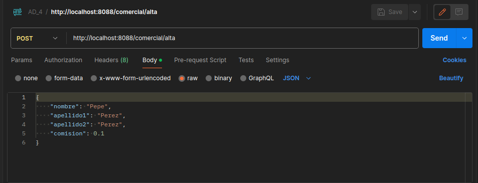

### Respuesta

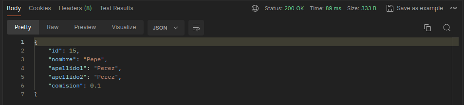

```json
{
  "id": 15,
  "nombre": "Pepe",
  "apellido1": "Perez",
  "apellido2": "Perez",
  "comision": 0.1
}
```

### Base de datos

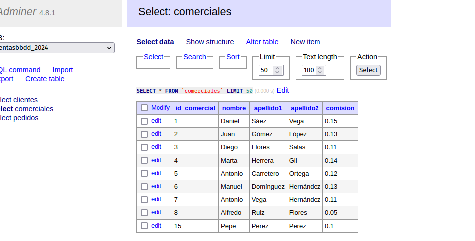

## GET /comercial/uno/{idComercial}

Se devuelve el comercial con el idComercial indicado.

### Postman

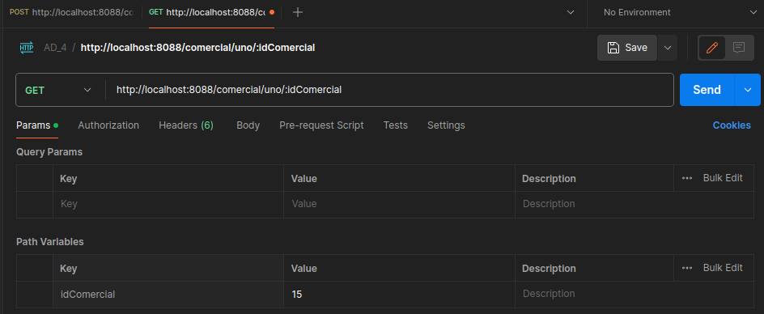

### Respuesta

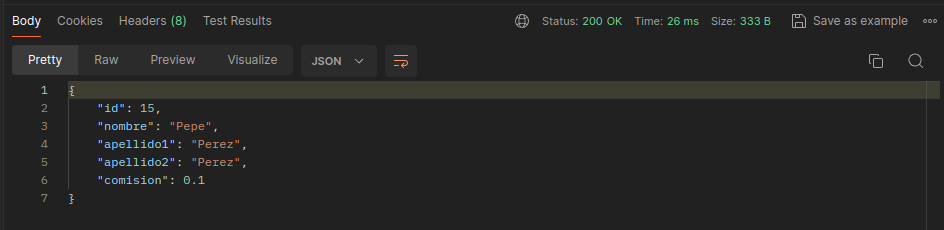

```json
{
  "id": 15,
  "nombre": "Pepe",
  "apellido1": "Perez",
  "apellido2": "Perez",
  "comision": 0.1
}
```

### Base de datos

```sql
select * from comerciales where id_comercial = 15;
```

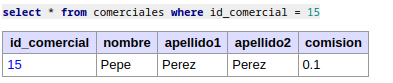

## DELETE /comercial/eliminar/{idComercial}

Se elimina el comercial con el idComercial indicado.

### Postman

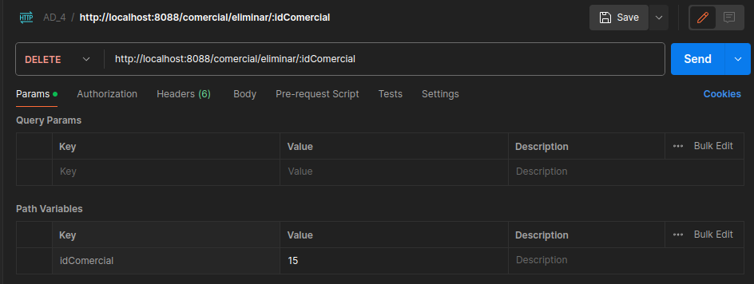

### Respuesta

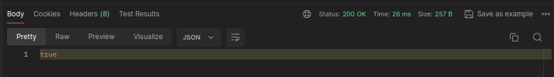

```json
true
```

### Base de datos

```sql
select * from comerciales where id_comercial = 15;
```

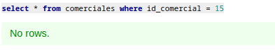

## GET /comercial/bycliente/{idCliente}

Lista de comerciales que tienen pedidos de un cliente concreto.

### Postman

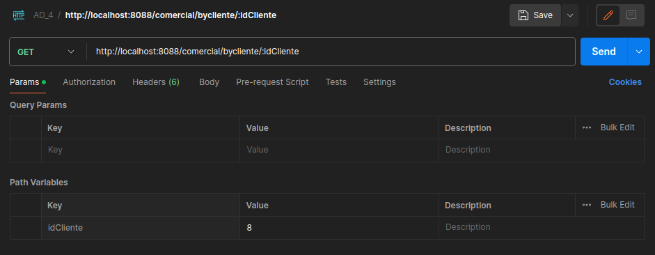

### Respuesta

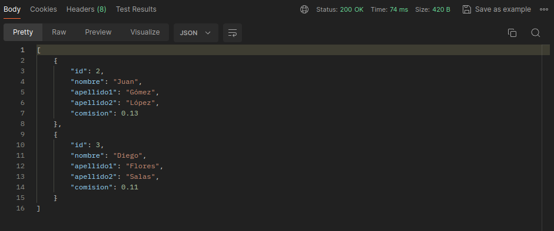

```json
[
  {
    "id": 2,
    "nombre": "Juan",
    "apellido1": "Gómez",
    "apellido2": "López",
    "comision": 0.13
  },
  {
    "id": 3,
    "nombre": "Diego",
    "apellido1": "Flores",
    "apellido2": "Salas",
    "comision": 0.11
  }
]
```

### Base de datos

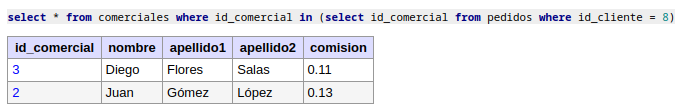

```sql
select * from comerciales where id_comercial in (select id_comercial from pedidos where id_cliente = 8);
```

## GET /comercial/conpedidos

Lista de comerciales que tienen al menos un pedido.

### Postman


### Respuesta

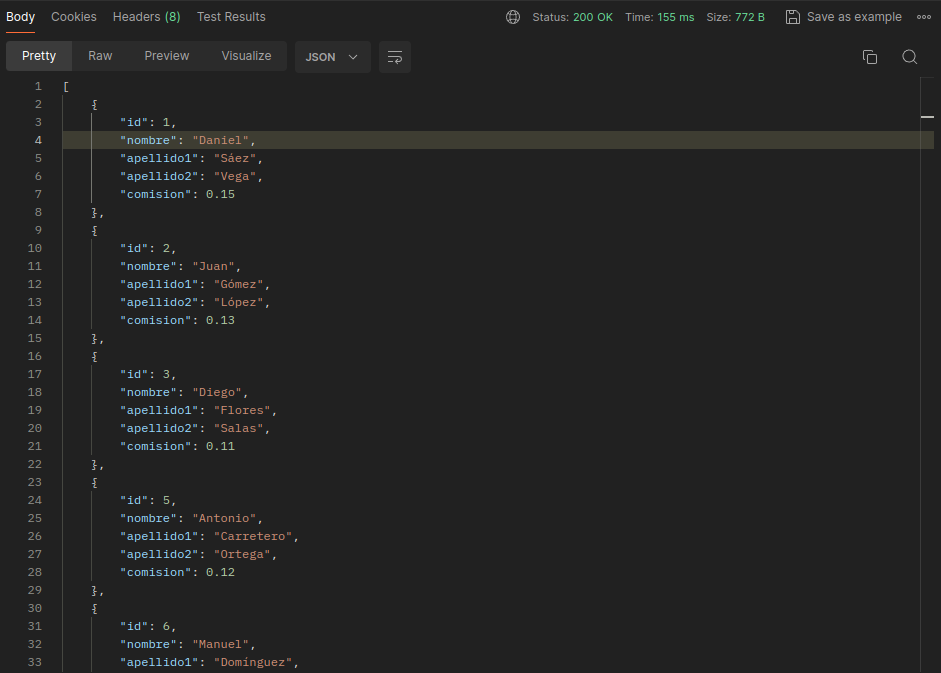

```json
[
  {
    "id": 1,
    "nombre": "Daniel",
    "apellido1": "Sáez",
    "apellido2": "Vega",
    "comision": 0.15
  },
  {
    "id": 2,
    "nombre": "Juan",
    "apellido1": "Gómez",
    "apellido2": "López",
    "comision": 0.13
  },
  {
    "id": 3,
    "nombre": "Diego",
    "apellido1": "Flores",
    "apellido2": "Salas",
    "comision": 0.11
  },
  {
    "id": 5,
    "nombre": "Antonio",
    "apellido1": "Carretero",
    "apellido2": "Ortega",
    "comision": 0.12
  },
  {
    "id": 6,
    "nombre": "Manuel",
    "apellido1": "Domínguez",
    "apellido2": "Hernández",
    "comision": 0.13
  },
  {
    "id": 7,
    "nombre": "Antonio",
    "apellido1": "Vega",
    "apellido2": "Hernández",
    "comision": 0.11
  }
]
```

### Base de datos

```sql
select * from comerciales where id in (select id_comercial from pedidos);
```

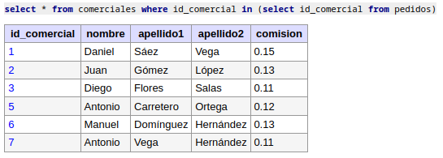

## GET /comercial/pedidos/{idComercial}

Lista de pedidos de un comercial concreto.

### Postman

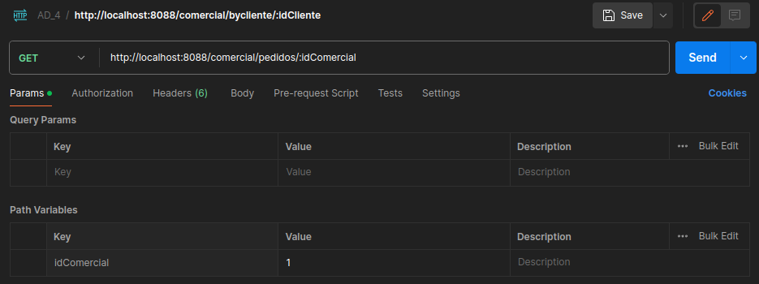

### Respuesta

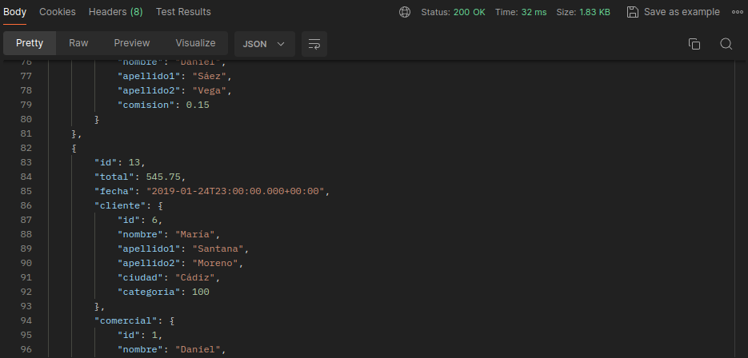

```json
[
  {
    "id": 3,
    "total": 65.26,
    "fecha": "2017-10-04T22:00:00.000+00:00",
    "cliente": {
      "id": 2,
      "nombre": "Adela",
      "apellido1": "Salas",
      "apellido2": "Díaz",
      "ciudad": "Granada",
      "categoria": 200
    },
    "comercial": {
      "id": 1,
      "nombre": "Daniel",
      "apellido1": "Sáez",
      "apellido2": "Vega",
      "comision": 0.15
    }
  },
  {
    "id": 6,
    "total": 2400.6,
    "fecha": "2016-07-26T22:00:00.000+00:00",
    "cliente": {
      "id": 7,
      "nombre": "Pilar",
      "apellido1": "Ruiz",
      "apellido2": null,
      "ciudad": "Sevilla",
      "categoria": 300
    },
    "comercial": {
      "id": 1,
      "nombre": "Daniel",
      "apellido1": "Sáez",
      "apellido2": "Vega",
      "comision": 0.15
    }
  },
  {
    "id": 7,
    "total": 5760.0,
    "fecha": "2015-09-09T22:00:00.000+00:00",
    "cliente": {
      "id": 2,
      "nombre": "Adela",
      "apellido1": "Salas",
      "apellido2": "Díaz",
      "ciudad": "Granada",
      "categoria": 200
    },
    "comercial": {
      "id": 1,
      "nombre": "Daniel",
      "apellido1": "Sáez",
      "apellido2": "Vega",
      "comision": 0.15
    }
  },
  {
    "id": 12,
    "total": 3045.6,
    "fecha": "2017-04-24T22:00:00.000+00:00",
    "cliente": {
      "id": 2,
      "nombre": "Adela",
      "apellido1": "Salas",
      "apellido2": "Díaz",
      "ciudad": "Granada",
      "categoria": 200
    },
    "comercial": {
      "id": 1,
      "nombre": "Daniel",
      "apellido1": "Sáez",
      "apellido2": "Vega",
      "comision": 0.15
    }
  },
  {
    "id": 13,
    "total": 545.75,
    "fecha": "2019-01-24T23:00:00.000+00:00",
    "cliente": {
      "id": 6,
      "nombre": "María",
      "apellido1": "Santana",
      "apellido2": "Moreno",
      "ciudad": "Cádiz",
      "categoria": 100
    },
    "comercial": {
      "id": 1,
      "nombre": "Daniel",
      "apellido1": "Sáez",
      "apellido2": "Vega",
      "comision": 0.15
    }
  },
  {
    "id": 14,
    "total": 145.82,
    "fecha": "2017-02-01T23:00:00.000+00:00",
    "cliente": {
      "id": 6,
      "nombre": "María",
      "apellido1": "Santana",
      "apellido2": "Moreno",
      "ciudad": "Cádiz",
      "categoria": 100
    },
    "comercial": {
      "id": 1,
      "nombre": "Daniel",
      "apellido1": "Sáez",
      "apellido2": "Vega",
      "comision": 0.15
    }
  }
]
```

### Base de datos

```sql
select * from pedidos where id_comercial = 1;
```

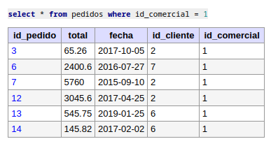
