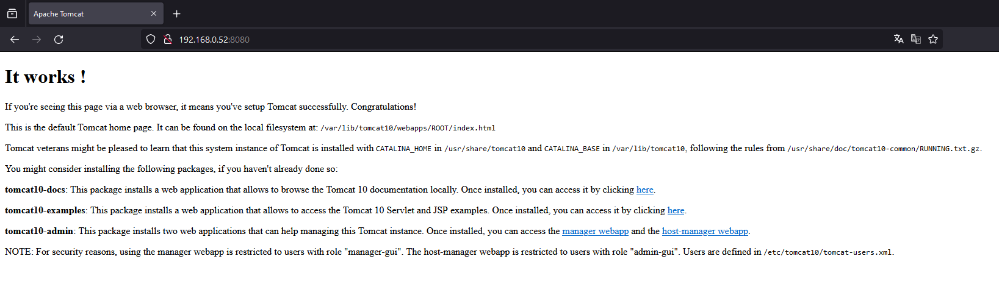
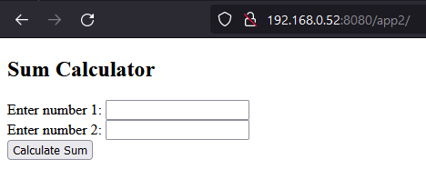

# Ad-2 Servidores

## Aclaraciones

Para la realización de esta práctica se ha utilizado una máquina virtual con sistema Debian 12.
En orden de simular un equipo real, se esta usando de Network settings `Bridged Adapter` para que la máquina tenga su propia ip en la red.

- Nombre de la máquina: `debianServer`
- Usuario: `username`
- Contraseña: `password`

Durante la instalación del sistema no se han instalado ni entornos gráficos ni programas adicionales.

Se ha creado un usuario llamado `username`

## Sistema

### Especificaciones

Sistema Debian 12

- 2Gb RAM
- 2 CPU

### Configuración base

1. Se inicia sesión con el usuario `root`

2. Se actualiza el sistema con el comando

```bash
apt update && apt upgrade -y
```

3. Se instalan los programas base con el comando

- sudo para dar permisos de administrador al usuario `username`
- vim para editar archivos
- net-tools para comprobar la configuración de red
- passwd para cambiar la contraseña de los usuarios en caso de ser necesario

```bash
apt install -y sudo vim net-tools passwd
```

1. Se dan permisos de sudo al usuario `username` con el comando

```bash
usermod -aG sudo username
```

5. Iniciar sesión con el usuario `username` y comprobar que tiene permisos de sudo con el comando

```bash
su - username
sudo echo "hola"
```

### Firewall

1. Instalar el firewall con el comando

```bash
sudo apt install -y ufw
```

2. Habilitar el firewall con el comando

```bash
sudo ufw enable
```

### Servicio SSH

1. Instalar el servidor SSH con el comando

```bash
sudo apt install -y openssh-server
```

2. Comprobar que el servicio esta activo con el comando

```bash
sudo systemctl status ssh
```

3. Añadir una regla al firewall para permitir el tráfico SSH con el comando

```bash
sudo ufw allow OpenSSH
sudo ufw allow ssh
sudo ufw reload
```

4. Conectar por SSH desde el equipo local con el comando

```bash
ssh -p 22 user@ip
```

Utilizar el comando `sudo ufw status` para comprobar que las reglas se han añadido correctamente.
Nos debe mostrar algo similar a esto:

```bash
user@debianServer:~$ sudo ufw status
Status: active

To                         Action      From
--                         ------      ----
OpenSSH                    ALLOW       Anywhere
22/tcp                     ALLOW       Anywhere
OpenSSH (v6)               ALLOW       Anywhere (v6)
22/tcp (v6)                ALLOW       Anywhere (v6)
```

### Servicio FTP

1. Instalar el servidor FTP con el comando

```bash
sudo apt install -y vsftpd ftp
```

2. Añadir una regla al firewall para permitir el tráfico FTP con el comando

```bash
sudo ufw allow ftp
sudo ufw allow 20/tcp
sudo ufw allow 21/tcp
sudo ufw reload
```

Estado de la configuración del firewall

```bash
Status: active

To                         Action      From
--                         ------      ----
OpenSSH                    ALLOW       Anywhere
22/tcp                     ALLOW       Anywhere
21/tcp                     ALLOW       Anywhere
20/tcp                     ALLOW       Anywhere
OpenSSH (v6)               ALLOW       Anywhere (v6)
22/tcp (v6)                ALLOW       Anywhere (v6)
21/tcp (v6)                ALLOW       Anywhere (v6)
20/tcp (v6)                ALLOW       Anywhere (v6)
```

3. Comprobar que el servicio esta activo con el comando

```bash
sudo systemctl status vsftpd
```

4. Conectar por ftp desde el equipo local con filezilla


Poder ver el contenido de la carpeta `/home/username` desde el equipo local


### Conclusiones

Hasta este punto se ha configurado el sistema base con un firewall, un servidor SSH y un servidor FTP.
Esto nos permitirá acceder al sistema de forma remota gracias al servicio SSH y subir archivos al sistema gracias al servicio FTP.

## Aplicación 1

Para la aplicación 1 se ha decidido montar un servidor Apache encargado de alojar una aplicación web desarrollada con PHP.

### Tecnologias

- Lenguaje de front
  - HTML5
  - CSS3
  - Javascript
- Lenguaje de back
  - PHP
- BBDD
  - MySql

### Instalación

#### Servidor Apache

1. Instalar el servidor Apache con el comando

```bash
sudo apt install -y apache2
```

2. Comprobar que el servicio esta activo con el comando

```bash
sudo systemctl status apache2
```

3. Añadir una regla al firewall para permitir el tráfico HTTP con el comando

```bash
sudo ufw allow http
sudo ufw allow 80/tcp
sudo ufw reload
```

4. Acceder a la ip de la máquina virtual desde el navegador para comprobar que el servidor esta activo


#### PHP

1. Instalar el lenguaje de programación PHP con el comando

```bash
sudo apt install -y php libapache2-mod-php
```

2. Comprobar que php se ha instalado correctamente

- Crear un archivo `phpinfo.php` en el directorio `/var/www/html` con el comando

```bash
sudo echo "<?php phpinfo(); ?>" | sudo tee /var/www/html/phpinfo.php
```

3. Habilitar el módulo de Apache con el comando

```bash
sudo a2enmod php
```

- Acceder a la ip de la máquina virtual desde el navegador y añadir `/phpinfo.php` para comprobar que php esta activo


#### MySql

1. Instalar el gestor de base de datos MySql con el comando

```bash
sudo apt install -y mariadb-server
sudo mysql_secure_installation
```

2. Acceder a MySql con el comando

```bash
sudo mysql
```

3. Configurar el usuario para la base de datos

```sql
CREATE USER 'username'@'localhost' IDENTIFIED BY 'password';
GRANT ALL PRIVILEGES ON *.* TO 'username'@'localhost' WITH GRANT OPTION;
exit
```

4. Acceder a MySql con el usuario creado

```bash
mysql -u username -p
```

5. Crear una base de datos para la aplicación

```sql
CREATE DATABASE app1;
```

6. Crear una tabla para la aplicación

```sql
USE app1;
CREATE TABLE tareas (id INT AUTO_INCREMENT PRIMARY KEY, tarea VARCHAR(100), fecha DATE);
INSERT INTO tareas (tarea, fecha) VALUES ('tarea1', '2022-12-31');
INSERT INTO tareas (tarea, fecha) VALUES ('tarea2', '2022-12-31');
INSERT INTO tareas (tarea, fecha) VALUES ('tarea3', '2022-12-31');
```

7. Reiniciar el servidor Apache con el comando

```bash
sudo systemctl restart apache2
```

#### PhpMyAdmin

1. Instalar el gestor de base de datos PhpMyAdmin con el comando

```bash
sudo apt install -y phpmyadmin
```

- Durante la instalación seleccionar `apache2` como servidor
- Seleccionar `yes` para configurar la base de datos
- Introducir la contraseña para la base de datos

2. Crear un enlace para poder acceder a phpmyadmin desde el servidor web

```bash
sudo ln -s /usr/share/phpmyadmin /var/www/html/phpmyadmin
```

3. Habilitar el módulo de Apache para PHP con el comando

```bash
sudo phpenmod mbstring
sudo phpenmod mysqli
```

4. Reiniciar apache para aplicar los cambios

```bash
sudo service apache2 restart
```

5. Acceder a la ip de la máquina virtual desde el navegador y añadir `/phpmyadmin` para comprobar que phpmyadmin esta activo


Ya tenemos instalado el servidor ftp, ahora vamos a configurar el acceso a la aplicación.

1. Dar permisos de escritura al directorio `/var/www/html` con el comando

```bash
sudo chmod 775 /var/www/html
sudo chown -R username /var/www/html
```

2. Asegurarse que en el archivo `/etc/vsftpd.conf` tiene las siguientes configuraciones

```bash
local_umask=022
write_enable=YES
local_root=/var/www/html
chroot_local_user=YES
```

- En filezilla si no se puede establecer la conexión, en ajustes -> ftp -> modo de transferencia -> activo

3. Conectar por ftp desde el equipo local con filezilla


#### Crear aplicación

1. Crear el directorio de la aplicación en el directorio `/var/www/html` con el comando

```bash
sudo mkdir /var/www/html/app1
```

##### Opción 1 - Editar archivos desde el servidor

2. Crear el archivo `index.php` en el directorio `/var/www/html/app1` con el comando

```bash
sudo echo "<?php echo 'hola'; ?>" | sudo tee /var/www/html/app1/index.php
```

3. Acceder a la ip de la máquina virtual desde el navegador y añadir `/app1` para comprobar que la aplicación esta activa

4. Modificar el archivo `index.php` para que se conecte a la base de datos

```php
<?php
$servername = "localhost";
$username = "username";
$password = "password";
$dbname = "app1";

$conn = new mysqli($servername, $username, $password, $dbname);

if ($conn->connect_error) {
	die("Connection failed: " . $conn->connect_error);
}

$sql = "SELECT id, tarea, fecha FROM tareas";
$result = $conn->query($sql);

if ($result->num_rows > 0) {
	echo "<table><tr><th>ID</th><th>Tarea</th><th>Fecha</th></tr>";
	while($row = $result->fetch_assoc()) {
		echo "<tr><td>" . $row["id"]. "</td><td>" . $row["tarea"]. "</td><td>" . $row["fecha"]. "</td></tr>";
	}
	echo "</table>";
} else {
	echo "0 results";
}

$conn->close();

?>
```

5. Acceder a la ip de la máquina virtual desde el navegador y añadir `/app1` para comprobar que la aplicación esta activa


##### Opción 2 - Subir archivos desde el equipo local usando ftp

1. Conectar por ftp desde el equipo local con filezilla

- Host: ip de la máquina virtual
- Usuario: username
- Contraseña: password
- Puerto: 21

2. Subir el archivo `index.php` al directorio `/var/www/html/app1`

3. Acceder a la ip de la máquina virtual desde el navegador y añadir `/app1` para comprobar que la aplicación esta activa

## Aplicación 2

### Tecnologias

- Lenguaje de front
  - HTML5
  - CSS3
  - Javascript
- Lenguaje de back
  - Java
- BBDD
  - MySql
- Servidor de aplicaciones
  - Tomcat

### Instalación

#### Servidor Tomcat

1. Instalar el servidor Tomcat con el comando

- `tomcat10` es la versión de Tomcat que se instala
- `tomcat10-admin` es la interfaz web para administrar Tomcat
- `tomcat10-common` es la documentación y los archivos comunes
- `tomcat10-user` es el usuario que ejecuta Tomcat
- `tomcat10-docs` es la documentación
- `tomcat10-examples` son ejemplos de aplicaciones

```bash
sudo apt install -y tomcat10 tomcat10-admin tomcat10-common tomcat10-user tomcat10-docs tomcat10-examples
```

2. Comprobar que el servicio esta activo con el comando

```bash
sudo systemctl status tomcat10
```

3. Añadir una regla al firewall para permitir el tráfico HTTP con el comando. El puerto por defecto de Tomcat es el 8080

```bash
sudo ufw allow 8080/tcp

sudo ufw reload
```

4. Acceder a la ip de la máquina virtual desde el navegador y añadir `:8080` para comprobar que el servidor esta activo



#### MySql

1. Instalar el gestor de base de datos MySql con el comando

```bash
sudo apt install -y mariadb-server
sudo mysql_secure_installation
```

2. Acceder a MySql con el comando

```bash
sudo mysql
```

3. Configurar el usuario para la base de datos

```sql
CREATE USER 'username'@'localhost' IDENTIFIED BY 'password';
GRANT ALL PRIVILEGES ON *.* TO 'username'@'localhost' WITH GRANT OPTION;
exit
```

4. Acceder a MySql con el usuario creado

```bash
mysql -u username -p
```

5. Crear una base de datos para la aplicación

```sql
CREATE DATABASE app2;
```

6. Crear una tabla para la aplicación

```sql
USE app2;
CREATE TABLE tareas (id INT AUTO_INCREMENT PRIMARY KEY, tarea VARCHAR(100), fecha DATE);
INSERT INTO tareas (tarea, fecha) VALUES ('tarea1', '2022-12-31');
INSERT INTO tareas (tarea, fecha) VALUES ('tarea2', '2022-12-31');
INSERT INTO tareas (tarea, fecha) VALUES ('tarea3', '2022-12-31');
```

#### Configuración ftp para subir archivos a la aplicación

Ya tenemos instalado el servidor ftp, ahora vamos a configurar el acceso a la aplicación.

1. Dar permisos de escritura al directorio `/var/lib/tomcat10/webapps` con el comando

```bash
sudo chmod 777 /var/lib/tomcat10/webapps
sudo chown -R username /var/lib/tomcat10/webapps
```

2. Asegurarse que en el archivo `/etc/vsftpd.conf` tiene la siguiente configuración

```bash
local_umask=022
write_enable=YES
local_root=/var/lib/tomcat10/webapps
chroot_local_user=YES
```

3. Reiniciar el servidor ftp con el comando

```bash
sudo systemctl restart vsftpd
```

4. Conectar por ftp desde el equipo local con filezilla


#### Crear un usuario para la interfaz de administración de Tomcat

1. Añadir un usuario al archivo `/etc/tomcat10/tomcat-users.xml` con el comando

```bash
sudo vim /etc/tomcat10/tomcat-users.xml
```

Descomentar la sección que contiene el usuario y la contraseña

```xml
<user username="admin" password="<must-be-changed>" roles="manager-gui"/>
<user username="robot" password="<must-be-changed>" roles="manager-script"/>
```

2. Reiniciar el servidor Tomcat con el comando

```bash
sudo systemctl restart tomcat10
```

3. Acceder a la ip de la máquina virtual desde el navegador y añadir `:8080/manager/html` para comprobar que la interfaz de administración de Tomcat esta activa


#### Crear aplicación

1. Crear el directorio de la aplicación en el directorio `/var/lib/tomcat10/webapps` con el comando

```bash
sudo mkdir /var/lib/tomcat10/webapps/app2
```

##### Opción 1 - Editar archivos desde el servidor

2. Crear el archivo `index.jsp` en el directorio `/var/lib/tomcat10/webapps/app2` y añadir el código

```jsp
<!DOCTYPE html>
<html>
<head>
    <title>Sumar dos Números</title>
</head>
<body>
    <h2>Sumar Números</h2>
    <form action="calculate.jsp" method="post">
        Número 1: <input type="text" name="num1"><br>
        Número 2: <input type="text" name="num2"><br>
        <input type="submit" value="Calcular Suma">
    </form>
</body>
</html>

```

3. Crear el archivo `calculate.jsp` en el directorio `/var/lib/tomcat10/webapps/app2` y añadir el código

```jsp

<%@ page import="java.io.*,java.util.*" %>
<%@ page import="javax.servlet.*,javax.servlet.http.*" %>

<%
		// Se obtienen los parametros del formulario
    String num1Str = request.getParameter("num1");
    String num2Str = request.getParameter("num2");

		// Se convierten los parametros a enteros
    int num1 = Integer.parseInt(num1Str);
    int num2 = Integer.parseInt(num2Str);

		// Se realiza la suma
    int sum = num1 + num2;
%>

<!DOCTYPE html>
<html>
<head>
    <title>Sumar dos Numeros</title>
</head>
<body>
    <h2>Sumar dos Numeros</h2>
    <p>Numero 1: <%= num1 %></p>
    <p>Numero 2: <%= num2 %></p>
    <p>Suma: <%= sum %></p>
</body>
</html>
```

4. Acceder a la ip de la máquina virtual desde el navegador y ir al panel de administración de Tomcat para comprobar que la aplicación esta activa


5. Acceder a la ip de la máquina virtual desde el navegador y añadir `:8080/app2` para ver la aplicación




##### Opción 2 - Subir archivos desde el equipo local usando ftp

1. Conectar por ftp desde el equipo local con filezilla

- Host: ip de la máquina virtual
- Usuario: username
- Contraseña: password
- Puerto: 21

2. Subir el archivo `index.jsp` y `calculate.jsp` al directorio `/var/lib/tomcat10/webapps/app2`

3. Acceder a la ip de la máquina virtual desde el navegador y añadir `/app2` para comprobar que la aplicación esta activa
4. Reiniciar el servidor Tomcat con el comando

```bash

sudo systemctl restart tomcat10
```

## Conclusiones

De forma base se ha configurado un servidor Debian 12 con un firewall, un servidor SSH y un servidor FTP.

Sobre este sistema se han montado dos aplicaciones web.

La primera aplicación se ha montado sobre un servidor Apache con PHP y MySql.

- Se ha configurado el servidor Apache y se ha comprobado que esta activo
- Se ha configurado PHP y se ha comprobado que esta activo
- Se ha configurado MySql y se ha comprobado que esta activo
- Se ha instalado PhpMyAdmin y se ha comprobado que esta activo
- Se ha configurado el servidor FTP y se ha configurado para dar acceso al directorio de la aplicación
- Se ha creado una aplicación web y se ha comprobado que esta activa
- Se ha comprobado que se puede subir archivos a la aplicación
- Se ha comprobado que se puede acceder a la base de datos desde la aplicación
- Se ha comprobado que se puede acceder a la base de datos desde PhpMyAdmin
- Se ha comprobado que se puede acceder a la aplicación desde el equipo local

La segunda aplicación se ha montado sobre un servidor Tomcat con MySql.

- Se ha configurado el servidor Tomcat y se ha comprobado que esta activo
- Se ha configurado MySql y se ha comprobado que esta activo
- Se ha configurado el servidor FTP y se ha configurado para dar acceso al directorio de la aplicación
- Se ha creado una aplicación web y se ha comprobado que esta activa
- Se ha comprobado que se puede subir archivos a la aplicación
- Se ha comprobado que se puede acceder a la aplicación desde el panel de administración de Tomcat
- Se ha comprobado que se puede acceder a la aplicación desde el equipo local


