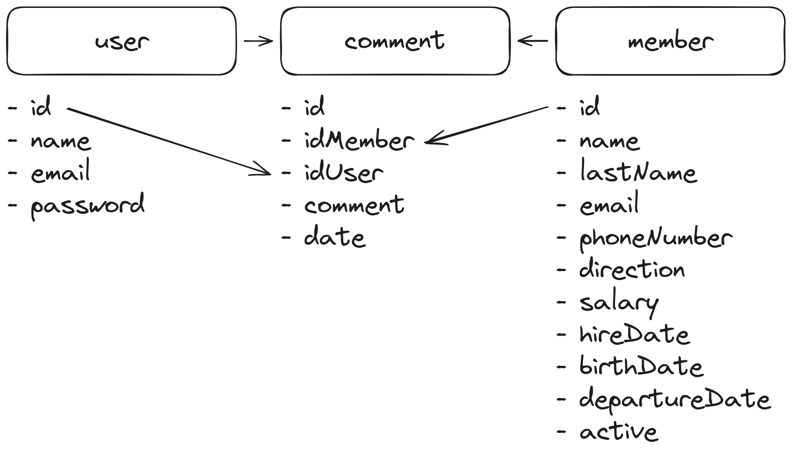

# AD-3 - API REST

Para este proyecto se va a hacer una herramienta para un equipo de recursos humanos que les permita llevar un control de los empleados, sus datos personales, sus salarios, sus vacaciones, sus bajas, sus permisos, etc. a traves de comentarios, son 3 tablas las que se van a utilizar,

Usuario - Que es la persona de recursos humanos que va a utilizar la herramienta
Empleado - Que es el empleado de la empresa
Comentario - Que es el comentario que se va a hacer sobre el empleado, puede consistir en una baja, un permiso, una vacación, un comentario sobre el salario, etc.

## Base de datos



```sql
CREATE DATABASE IF NOT EXISTS `rrhh`;

USE `rrhh`;

CREATE TABLE IF NOT EXISTS `user` (
    `id` INT(11) NOT NULL AUTO_INCREMENT,
    `name` VARCHAR(255) NOT NULL,
    `email` VARCHAR(255) NOT NULL,
    `password` VARCHAR(255) NOT NULL,
    PRIMARY KEY (`id`)
);

CREATE TABLE IF NOT EXISTS `member` (
    `id` INT(11) NOT NULL AUTO_INCREMENT,
    `name` VARCHAR(255) NOT NULL,
    `lastName` VARCHAR(255) NOT NULL,
    `email` VARCHAR(255) NOT NULL,
    `phoneNumber` VARCHAR(255) NOT NULL,
    `direction` VARCHAR(255) NOT NULL,
    `salary` DECIMAL(10,2) NOT NULL,
    `birthDate` DATE NOT NULL,
    `hireDate` DATE NOT NULL,
    `departureDate` DATE,
    `active` TINYINT(1) NOT NULL,
    PRIMARY KEY (`id`)
);

CREATE TABLE IF NOT EXISTS `comment` (
    `id` INT(11) NOT NULL AUTO_INCREMENT,
    `idMember` INT(11) NOT NULL,
    `idUser` INT(11) NOT NULL,
    `comment` TEXT NOT NULL,
    `date` DATE NOT NULL,
    PRIMARY KEY (`id`)
);

```

Las urls que se van a utilizar son las siguientes:

GET /api/usuarios/:id 
- Obtener un usuario en concreto
- :id - El id del usuario
- Devuelve un objeto con los datos del usuario

POST /api/usuarios
- Crear un usuario
- Se le pasa un objeto con los datos del usuario
- Devuelve un objeto con los datos del usuario

PUT /api/usuarios/:id 
- Modificar un usuario
- :id - El id del usuario
- Se le pasa un objeto con los datos del usuario
- Devuelve un objeto con los datos nuevos del usuario

DELETE /api/usuarios/:id 
- Para borrar un usuario
- :id - El id del usuario
- Un booleano si se ha borrado o no


GET /api/empleados 
- Para obtener todos los empleados
- Devuelve un array con todos los empleados

GET /api/empleados/:id 
- Para obtener un empleado en concreto
- :id - El id del empleado
- Devuelve un objeto con los datos del empleado

POST /api/empleados 
- Para crear un empleado
- Se le pasa un objeto con los datos del empleado
- Devuelve un objeto con los datos del empleado

PUT /api/empleados/:id 
- Para modificar un empleado
- :id - El id del empleado
- Se le pasa un objeto con los datos del empleado
- Devuelve un objeto con los datos nuevos del empleado

DELETE /api/empleados/:id 
- Para borrar un empleado
- :id - El id del empleado
- Un booleano si se ha borrado o no

GET /api/comentarios/:idEmpleado 
- Para obtener todos los comentarios de un empleado
- :idEmpleado - El id del empleado
- Devuelve un array con todos los comentarios de un empleado

GET /api/comentarios/:idEmpleado/:id 
- Para obtener un comentario en concreto de un empleado
- :idEmpleado - El id del empleado
- :id - El id del comentario
- Devuelve un objeto con los datos del comentario
POST /api/comentarios 
- Para crear un comentario
- Se le pasa un objeto con los datos del comentario
- Devuelve un objeto con los datos del comentario

PUT /api/comentarios/:id 
- Para modificar un comentario
- :id - El id del comentario
- Se le pasa un objeto con los datos del comentario
- Devuelve un objeto con los datos nuevos del comentario

DELETE /api/comentarios/:id 
- Para borrar un comentario
- :id - El id del comentario
- Devuelve un booleano si se ha borrado o no

